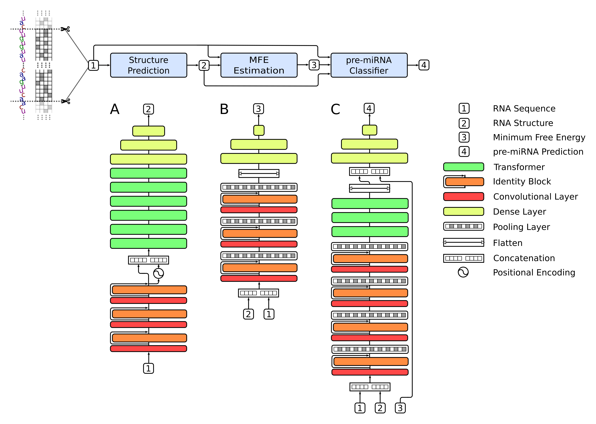

# miRe2e

This package contains the original methods proposed in:

J. Raad, L. A. Bugnon, D. H. Milone and G. Stegmayer, "*miRe2e: a full
end-to-end deep model based on Transformers for prediction
of pre-miRNAs from raw genome-wide data*", 2021.

miRe2e is a novel deep learning model that allows
finding  pre-miRNA sequences in raw genome-wide data. This model is a full
end-to-end neural architecture, using only the raw sequences as inputs.
This way, there is no need to use other libraries for preprocessing RNA sequences.

The model has 3 stages, as depicted in the figure:

1. Structure prediction model: predicts RNA secondary structure using only the input  sequence.
2. MFE estimation model: estimates the minimum free energy (MFE) when folding the secondary  structure.
3. Pre-miRNA classifier: uses the input RNA and the outputs of the two previous
  models to score the sequences for pre-miRNA candidates.
 


This repository is a package to easily use the miRe2e model. It provides models pre-trained with *H. sapiens*. It also provides the source code to train the models with your own data. miRe2e is open sourced and free to use. If you use any part of this package, please cite our work. 

An easy to try online demo is available at [https://sinc.unl.edu.ar/web-demo/miRe2e/](https://sinc.unl.edu.ar/web-demo/miRe2e/). This demo runs a pre-trained model on small RNA sequences. To use larger datasets or train your own model, see the following instructions.

## Quick start with pre-trained human model

When installing miRe2e, pre-trained weights for humans will be automatically downloaded.
The model receives a fasta file with a raw RNA sequence. The sequence is
analyzed with a sliding window, and a pre-miRNA score is assigned to each sub-sequence. 

You can find a complete demonstration of usage in [this notebook](https://colab.research.google.com/github/sinc-lab/miRe2e/blob/master/demo.ipynb). If you want to try the model as it is, it is recommended to **start with this notebook**

Reproducing paper results: [this notebook](https://colab.research.google.com/drive/1pI2SmT9s20LxnhJ_y8Tu4loDuyFNJNLi) contains the detailed steps to reproduce the results presented in the paper. 


## Installation

A Python>=3.7 distribution is required to use this package. If you plan to use a GPU, please check the [pytorch web](https://pytorch.org/get-started/locally/) to configure it correctly before installing this package. 

By default, the package use the cpu, thus it is recommended to use GPU to train the models.

Install the latest version of the package from PyPI:

    pip install -U miRe2e

 or clone this repository and install with:

    git clone git@github.com:sinc-lab/miRe2e.git
    cd miRe2e
    pip install .

## Local usage

The package can be used as depicted in the notebooks. The default pre-trained models, which were trained with *H. sapiens*, are loaded using:

```python
from miRe2e import MiRe2e
model = MiRe2e()
```

By default, MiRe2e object is created to use cpu only. If the server has at least one GPU, you need to pass the parameter device='cuda'. You can select a specific device, i.e. device='cuda:1' if you to have two  GPUs and you want to use the second one:

```python
from miRe2e import MiRe2e
model = MiRe2e(device='cuda:1')
```

The same way, you can load the model pre-trained with animals (excluding H. sapiens) with:
 
```python
model = MiRe2e(pretrained='animals')
```
To use other pretrained models:

```python
new_model = MiRe2e(mfe_model_file='trained_mfe_predictor.pkl',
                   structure_model_file='trained_structure_predictor.pkl',
                   predictor_model_file='trained_predictor.pkl')
```
These model files are optional and you can specify any of them. The ones that are not specified are loaded from pre-trained defaults. 
 
Check code documentation for advanced options.

## Training the models

Training the models may take several hours and requires GPU processing 
capabilities beyond the ones provided freely by Google Colab. In the 
following, there are instructions for training each stage of miRe2e. New models are saved as  pickle files (*.pkl). 

Training scripts were made for a 12GB GPU. You can adjust batch_size according to your hardware setup.
  

### Structure prediction model

To train the Structure prediction model, run:
```python
model.fit_structure('hairpin_examples.fa', batch_size=512)
```
The fasta file should contain sequences of hairpins and it's secondary structure. For example, the file [hairpin_examples.fa](https://sourceforge.net/projects/sourcesinc/files/mire2e/data/hairpin_examples.zip/download) can be used. The new model is saved in the root directory with the name “trained_structure_predictor.pkl”

### MFE estimation model

To train the MFE estimation model, run:
```python
model.fit_mfe('mfe_examples.fa')
```

The fasta file should contain sequences of pre-miRNAs, hairpins and flats with their target MFE. The example [mfe_examples.fa](https://sourceforge.net/projects/sourcesinc/files/mire2e/data/mfe_examples.zip/download) can be used. The new model is saved as “trained_mfe_predictor.pkl” 


### Pre-miRNA classifier model

To train the pre-miRNA classifier model, you need at least one set of 
positive samples (known pre-miRNA sequences) and a set of negative samples. 
Each sample must be a trimmed to 100 nt in length to use the current 
model configuration. These should be stored in a single fasta file. Furthermore, since the pre-miRNAs have an average length of less 
than 100nt, it is  necessary to randomly trim negative training sequences to match the positive distribution. This prevents that training got biased by the length of the sequences.          

To train this stage, run:

```python
model.fit(pos_fname='positive_examples.fa', 
          neg_fname='negative_examples.fa')
```
The examples in [positive_examples.fa](https://sourceforge.net/projects/sourcesinc/files/mire2e/data/positive_examples.zip/download) and [negative_examples.fa](https://sourceforge.net/projects/sourcesinc/files/mire2e/data/negative_examples.zip/download) can be used. The new model is saved as “trained_predictor.pkl”
